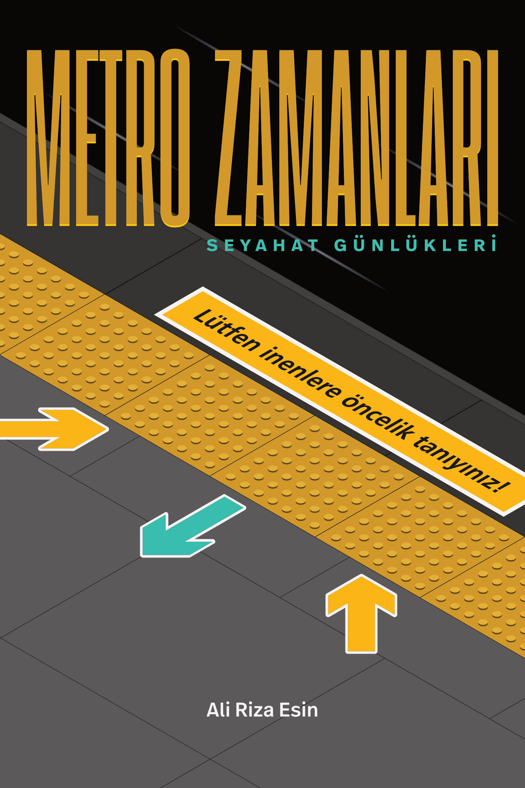

# Metro Zamanları, Ali Riza Esin
Yazanın 2010–2013 yılları arasında İstanbul metrosunun muhtelif hatlarında aldığı notlardan seçerek e-kitap biçiminde derlediği — tür olarak pek azı kurgu — yazılar ve kısa hikâyeler, seyahat günlükleri…


## Bağlantılar

### https://esin.net/metrozamanlari

[Web sayfası](https://esin.net/metrozamanlari/) - Kapakta kullanılan *temayı* canlandıran, cildin ekler bölümünde “Metro yer etiketleri için alternatif uyarı ifadeleri” başlığı altında yer verilen 40 klişeden ilkini sabit diğer dördünü rastgele görüntülemek suretiyle işleyen ve indirilebilir format çeşitlerine doğrudan erişim sağlayan tanıtım sayfası :link:

### https://vimeo.com/350958386

[Tanıtım videosu](https://vimeo.com/350958386) - Vimeo’da :link:


## Etiketler
Derlemeyi oluşturan kısa yazılara sınıflandırma anlamında *yakın* sayılabilecek bazı düz yazı ve kurmaca türleri:

```
anı, geziyazısı, günlük, deneme, öykü
```


## Kapak




## Lisans

[CC-BY-NC-ND](https://github.com/alirizaesin/metrozamanlari/blob/master/LICENSE) – Creative Commons Atıf-GayriTicari-Türetilemez 4.0 Uluslararası Lisansı ile lisanslanmıştır. Bazı hakları saklıdır.
